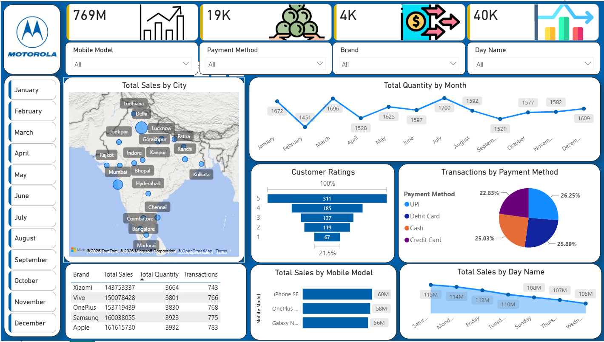

# 📱 Motorola Mobile Sales Dashboard (Power BI)

## 📌 Project Overview
This interactive Power BI dashboard offers end-to-end insights into **Motorola Mobile Sales Performance**. It enables data-driven decision-making by tracking Key Performance Indicators (KPIs) such as revenue, sales volume, customer ratings, and transaction trends across regions and mobile models.

## 🖼️ Dashboard Preview

---

## 📊 Key Features & Business Insights
* **Monthly Sales Analysis:** Custom vertical slicer covering all 12 months (Jan–Dec) for seamless filtering.
* **Top Performing Models:** Performance comparison of top mobile models by Total Sales, Quantity, and Transactions.
* **Customer Feedback:** Ratings distribution breakdown (1 to 5 stars) to assess customer satisfaction.
* **Payment Insights:** Sales analysis segmented by payment options and regions.

---

## 🛠️ Tools & Technologies
* **Power BI Desktop:** Custom slicer formatting, DAX measures, visual layouts.
* **Power Query:** Data cleaning, transformations, and schema preparation.
* **Dataset:** Excel / CSV file containing mobile sales data.

---

## 🚀 How to Run the Project
1. Download the `Motorola Mobile Sales Dashboard.pbix` file from this repository.
2. Open the file in **Power BI Desktop**.
3. Use the interactive slicers on the left panel to explore data by month, model, or payment mode.
